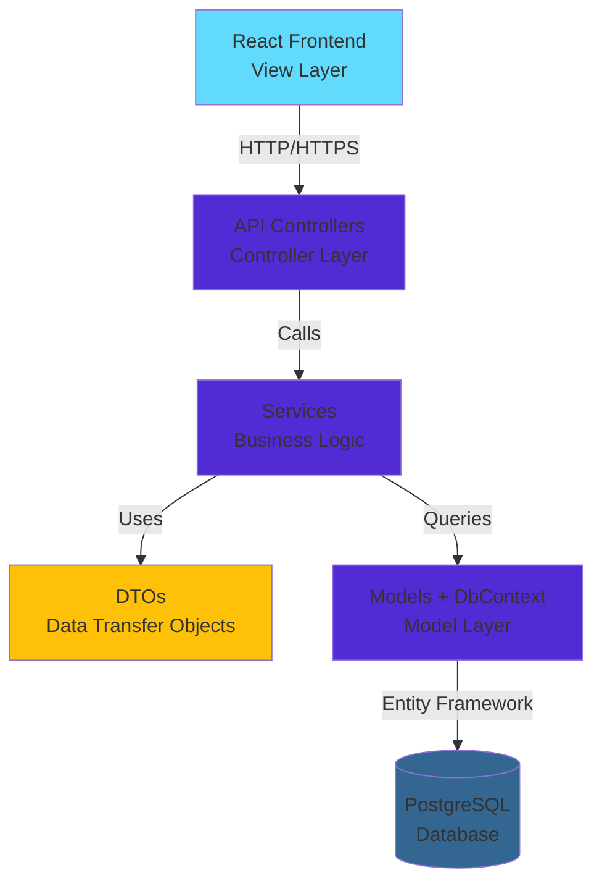
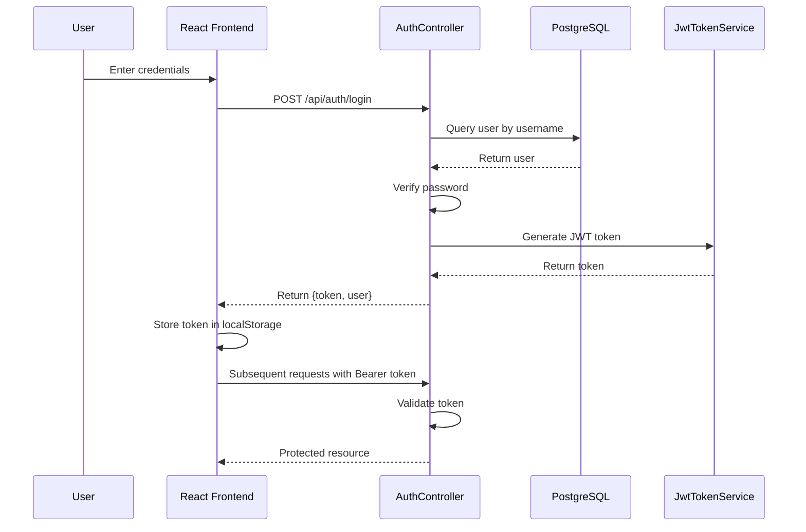

## Overview

The Legacy Migration Task Manager follows a modern **MVC (Model-View-Controller)** architecture with an additional **Service Layer** for business logic. This design separates concerns into distinct layers, making the codebase more maintainable, testable, and scalable.



## Technology stack

### Backend (.NET 10)

The backend is built with C# and .NET 10, leveraging the latest features and performance improvements.

<CodeGroup>
```xml Project file
<Project Sdk="Microsoft.NET.Sdk.Web">
  <PropertyGroup>
    <TargetFramework>net10.0</TargetFramework>
    <Nullable>enable</Nullable>
    <ImplicitUsings>enable</ImplicitUsings>
  </PropertyGroup>

  <ItemGroup>
    <PackageReference Include="Microsoft.AspNetCore.Authentication.JwtBearer" Version="10.0.2" />
    <PackageReference Include="Microsoft.AspNetCore.OpenApi" Version="10.0.1" />
    <PackageReference Include="Microsoft.EntityFrameworkCore.Tools" Version="10.0.2" />
    <PackageReference Include="Npgsql.EntityFrameworkCore.PostgreSQL" Version="10.0.0" />
    <PackageReference Include="System.IdentityModel.Tokens.Jwt" Version="8.15.0" />
  </ItemGroup>
</Project>
```

```csharp Program.cs configuration
var builder = WebApplication.CreateBuilder(args);

// Add services to the container
builder.Services.AddControllers();

// Configure CORS for frontend access
builder.Services.AddCors(options =>
{
    options.AddPolicy("AllowFrontend", policy =>
    {
        policy.AllowAnyOrigin()
            .AllowAnyMethod()
            .AllowAnyHeader();
    });
});

// Configure PostgreSQL with Entity Framework
builder.Services.AddDbContext<ProjectTemplateScharpContext>(options =>
{
    var connectionString = builder.Configuration.GetConnectionString("ProjectTemplateConnection") 
                          ?? builder.Configuration["DATABASE_URL"] 
                          ?? Environment.GetEnvironmentVariable("DATABASE_URL");
    
    options.UseNpgsql(connectionString, npgsqlOptions =>
    {
        npgsqlOptions.EnableRetryOnFailure(
            maxRetryCount: 3,
            maxRetryDelay: TimeSpan.FromSeconds(10),
            errorCodesToAdd: null);
        npgsqlOptions.CommandTimeout(30);
    });
});

// Register services with dependency injection
builder.Services.AddScoped<IUsersService, UsersService>();
builder.Services.AddScoped<ITaskService, TaskService>();
builder.Services.AddScoped<IProjectService, ProjectService>();
builder.Services.AddScoped<ICommentService, CommentService>();
builder.Services.AddScoped<IHistoryService, HistoryService>();
builder.Services.AddScoped<INotificationService, NotificationService>();

// Configure JWT authentication
var jwtKey = builder.Configuration["Jwt:Key"] 
          ?? builder.Configuration["JWT_KEY"] 
          ?? "DefaultJwtSecretKeyForDevelopmentPurposesOnly2024!";
var key = Encoding.UTF8.GetBytes(jwtKey);

builder.Services.AddAuthentication(JwtBearerDefaults.AuthenticationScheme)
    .AddJwtBearer(options =>
    {
        options.TokenValidationParameters = new TokenValidationParameters
        {
            ValidateIssuer = true,
            ValidateAudience = true,
            ValidateIssuerSigningKey = true,
            ValidIssuer = builder.Configuration["Jwt:Issuer"] ?? "TemplateAPI",
            ValidAudience = builder.Configuration["Jwt:Audience"] ?? "TemplateAPI",
            IssuerSigningKey = new SymmetricSecurityKey(key)
        };
    });

builder.Services.AddAuthorization();
builder.Services.AddSingleton<JwtTokenService>();

// Configure native OpenAPI (new in .NET 10)
builder.Services.AddOpenApi();
```
</CodeGroup>

<Info>
.NET 10 introduces native OpenAPI support, replacing Swashbuckle. The configuration is simpler and more performant.
</Info>

**Key dependencies**:

- **Entity Framework Core 10** - ORM for database operations
- **Npgsql** - PostgreSQL provider for EF Core
- **JWT Bearer Authentication** - Token-based security
- **Native OpenAPI** - API documentation generation

### Frontend (React 19)

The frontend is built with modern React and tooling:

```json package.json
{
  "dependencies": {
    "lucide-react": "^0.562.0",
    "react": "^19.2.3",
    "react-dom": "^19.2.3",
    "react-router-dom": "^6.30.3"
  },
  "devDependencies": {
    "@babel/core": "^7.28.5",
    "@babel/preset-react": "^7.28.5",
    "@tailwindcss/postcss": "^4.1.18",
    "tailwindcss": "^4.1.18",
    "webpack": "^5.104.0",
    "webpack-dev-server": "^5.2.3"
  }
}
```

**Key dependencies**:

- **React 19** - Latest React with improved performance
- **React Router v6** - Client-side routing
- **Tailwind CSS 4** - Utility-first styling
- **Lucide React** - Icon library
- **Webpack 5** - Module bundler

### Database (PostgreSQL)

PostgreSQL is used for data persistence, chosen for its:

- **Reliability**: ACID compliance and data integrity
- **Performance**: Efficient indexing and query optimization
- **Deployment**: Better cloud platform support (Railway, etc.)
- **Features**: Advanced data types and constraints

## Layered architecture

### 1. View layer (React components)

The frontend is organized as a single-page application with React Router:

```jsx App.jsx
import React from 'react'
import { BrowserRouter as Router, Routes, Route, Navigate } from 'react-router-dom'
import Login from './pages/Login'
import Layout from './components/Layout'
import TaskManager from './pages/TaskManager'
import ProjectManager from './pages/ProjectManager'
import CommentManager from './pages/CommentManager'
import HistoryManager from './pages/HistoryManager'
import NotificationManager from './pages/NotificationManager'
import SearchManager from './pages/SearchManager'
import ReportManager from './pages/ReportManager'
import UserManager from './pages/UserManager'

export default function App() {
    return (
        <Router>
            <Routes>
                <Route path="/" element={<Navigate to="/login" replace />} />
                <Route path="/login" element={<Login />} />
                <Route path="/app" element={<Layout />}>
                    <Route index element={<Navigate to="/app/task" replace />} />
                    <Route path="task" element={<TaskManager />} />
                    <Route path="projects" element={<ProjectManager />} />
                    <Route path="comments" element={<CommentManager />} />
                    <Route path="historial" element={<HistoryManager />} />
                    <Route path="notificaciones" element={<NotificationManager />} />
                    <Route path="busqueda" element={<SearchManager />} />
                    <Route path="reportes" element={<ReportManager />} />
                    <Route path="users" element={<UserManager />} />
                </Route>
            </Routes>
        </Router>
    )
}
```

**Routing structure**:

- `/login` - Authentication page (public)
- `/app/*` - Protected routes requiring JWT token
  - `/app/task` - Task management (default)
  - `/app/projects` - Project organization
  - `/app/comments` - Comment management
  - `/app/historial` - Activity history
  - `/app/notificaciones` - User notifications
  - `/app/busqueda` - Global search
  - `/app/reportes` - Analytics and reports
  - `/app/users` - User management

### 2. Controller layer (API endpoints)

Controllers handle HTTP requests and delegate to services. They:

- Validate request data
- Extract authentication claims
- Call service methods
- Return appropriate HTTP responses

```csharp TasksController.cs (excerpt)
[ApiController]
[Route("api/[controller]")]
[Authorize]  // Requires JWT authentication
public class TasksController : ControllerBase
{
    private readonly ITaskService _taskService;
    private readonly ProjectTemplateScharpContext _context;

    public TasksController(ITaskService taskService, ProjectTemplateScharpContext context)
    {
        _taskService = taskService;
        _context = context;
    }

    [HttpGet]
    public async Task<IActionResult> GetAllTasks()
    {
        var result = await _taskService.GetAllTasksAsync();
        return result.Success ? Ok(result) : BadRequest(result);
    }

    [HttpGet("{id}")]
    public async Task<IActionResult> GetTaskById(int id)
    {
        var result = await _taskService.GetTaskByIdAsync(id);
        return result.Success ? Ok(result) : NotFound(result);
    }

    [HttpPost]
    public async Task<IActionResult> CreateTask([FromBody] TaskRequestDto taskRequest)
    {
        if (!ModelState.IsValid)
            return BadRequest(ModelState);

        // Extract user ID from JWT claims
        var userIdClaim = User.FindFirst(ClaimTypes.NameIdentifier);
        if (userIdClaim == null || !int.TryParse(userIdClaim.Value, out int userId))
            return Unauthorized("Usuario no válido");

        var result = await _taskService.CreateTaskAsync(taskRequest, userId);
        
        if (result.Success)
            return CreatedAtAction(nameof(GetTaskById), new { id = result.Data?.Id }, result);
        
        return BadRequest(result);
    }

    [HttpPut]
    public async Task<IActionResult> UpdateTask([FromBody] TaskUpdateDto taskUpdate)
    {
        if (!ModelState.IsValid)
            return BadRequest(ModelState);

        var userIdClaim = User.FindFirst(ClaimTypes.NameIdentifier);
        if (userIdClaim == null || !int.TryParse(userIdClaim.Value, out int userId))
            return Unauthorized("Usuario no válido");

        var result = await _taskService.UpdateTaskAsync(taskUpdate, userId);
        return result.Success ? Ok(result) : BadRequest(result);
    }

    [HttpDelete("{id}")]
    public async Task<IActionResult> DeleteTask(int id)
    {
        var userIdClaim = User.FindFirst(ClaimTypes.NameIdentifier);
        if (userIdClaim == null || !int.TryParse(userIdClaim.Value, out int userId))
            return Unauthorized("Usuario no válido");

        var result = await _taskService.DeleteTaskAsync(id, userId);
        return result.Success ? Ok(result) : NotFound(result);
    }

    [HttpGet("statistics")]
    public async Task<IActionResult> GetTaskStatistics()
    {
        var result = await _taskService.GetTaskStatisticsAsync();
        return result.Success ? Ok(result) : BadRequest(result);
    }
}
```

**Key controller features**:

- `[Authorize]` attribute requires valid JWT token
- User claims extraction from `ClaimTypes.NameIdentifier`
- Consistent response format with `Success` flag
- RESTful HTTP status codes (200, 201, 400, 401, 404)

### 3. Service layer (Business logic)

Services contain business logic and orchestrate data operations. They:

- Implement business rules
- Coordinate between multiple entities
- Handle transactions
- Create audit history entries
- Return standardized response objects

```csharp Example service structure
public interface ITaskService
{
    Task<Response<List<TaskResponseDto>>> GetAllTasksAsync();
    Task<Response<TaskResponseDto>> GetTaskByIdAsync(int id);
    Task<Response<TaskResponseDto>> CreateTaskAsync(TaskRequestDto taskRequest, int userId);
    Task<Response<TaskResponseDto>> UpdateTaskAsync(TaskUpdateDto taskUpdate, int userId);
    Task<Response<bool>> DeleteTaskAsync(int id, int userId);
    Task<Response<TaskStatisticsDto>> GetTaskStatisticsAsync();
    Task<Response<List<ReportDto>>> GetTasksByStateAsync();
    Task<Response<List<ReportDto>>> GetTasksByProjectAsync();
    Task<Response<List<ReportDto>>> GetTasksByUserAsync();
}

public class TaskService : ITaskService
{
    private readonly ProjectTemplateScharpContext _context;
    private readonly IHistoryService _historyService;

    public TaskService(ProjectTemplateScharpContext context, IHistoryService historyService)
    {
        _context = context;
        _historyService = historyService;
    }

    // Implementation of business logic
    // Handles validation, database operations, history tracking
}
```

**Service responsibilities**:

- Validate business rules (e.g., due dates, required fields)
- Execute database queries with Entity Framework
- Create history entries for audit trail
- Map between entities and DTOs
- Handle exceptions and return error messages

### 4. Model layer (Data entities)

Models represent database tables using Entity Framework:

```csharp TblTask.cs
namespace Template_API.Models;

public partial class TblTask
{
    public int Id { get; set; }
    public string Title { get; set; } = null!;
    public string? Description { get; set; }
    public int StateId { get; set; }
    public int PriorityId { get; set; }
    public int ProjectId { get; set; }
    public int AsignedId { get; set; }
    public DateOnly ExpirationDate { get; set; }
    public int EstimatedHours { get; set; } = 0;
    public int Usercreate { get; set; }
    public int? Usermod { get; set; }
    public DateTime? CreationDate { get; set; }
    public DateTime? ModificationDate { get; set; }
    public bool? Active { get; set; }
}
```

**Entity features**:

- Direct mapping to database tables
- Nullable reference types for C# 10
- Audit fields (Usercreate, CreationDate, etc.)
- Soft delete with `Active` flag

### 5. DTO layer (Data transfer objects)

DTOs shape data for API communication, separating internal models from external contracts:

```csharp Example DTOs
public class TaskRequestDto
{
    public string Title { get; set; } = null!;
    public string? Description { get; set; }
    public int StateId { get; set; }
    public int PriorityId { get; set; }
    public int ProjectId { get; set; }
    public int AsignedId { get; set; }
    public DateOnly ExpirationDate { get; set; }
    public int EstimatedHours { get; set; }
}

public class TaskResponseDto
{
    public int Id { get; set; }
    public string Title { get; set; } = null!;
    public string? Description { get; set; }
    public string State { get; set; } = null!;
    public string Priority { get; set; } = null!;
    public string Project { get; set; } = null!;
    public string AsignedTo { get; set; } = null!;
    public DateOnly ExpirationDate { get; set; }
    public int EstimatedHours { get; set; }
    public DateTime CreationDate { get; set; }
}

public class Response<T>
{
    public bool Success { get; set; }
    public string Message { get; set; } = string.Empty;
    public T? Data { get; set; }
}
```

**DTO benefits**:

- Hide internal implementation details
- Version API independently from database
- Include computed/joined data (e.g., state names)
- Consistent response format

## Authentication flow

The application uses JWT (JSON Web Tokens) for stateless authentication:



**Authentication implementation**:

```csharp AuthController.cs
[ApiController]
[Route("api/[controller]")]
public class AuthController : ControllerBase
{
    private readonly ProjectTemplateScharpContext _db;
    private readonly JwtTokenService _jwt;

    public AuthController(ProjectTemplateScharpContext db, JwtTokenService jwt)
    {
        _db = db;
        _jwt = jwt;
    }

    [HttpPost("login")]
    public async Task<ActionResult<LoginResponse>> Login([FromBody] LoginRequest req)
    {
        if (string.IsNullOrWhiteSpace(req.Username) || string.IsNullOrWhiteSpace(req.Password))
            return BadRequest("Username y password son requeridos");

        var user = await _db.TblUsers.FirstOrDefaultAsync(u => u.Username == req.Username);
        if (user == null || !(user.Active ?? false))
            return Unauthorized();

        var ok = string.Equals(user.Password, req.Password);
        if (!ok) return Unauthorized();

        var token = _jwt.CreateToken(user);
        return Ok(new LoginResponse
        {
            Token = token,
            User = new { id = user.Id, username = user.Username }
        });
    }
}
```

<Note>
This is an educational project, so passwords are compared directly without hashing. Production applications should use bcrypt or similar hashing algorithms.
</Note>

## Database schema

The PostgreSQL database uses the following core tables:

```
tbl_users
├── id (PK)
├── username
├── password
├── active
├── usercreate
└── creation_date

tbl_tasks
├── id (PK)
├── title
├── description
├── state_id (FK → tbl_states)
├── priority_id (FK → tbl_priorities)
├── project_id (FK → tbl_projects)
├── asigned_id (FK → tbl_users)
├── expiration_date
├── estimated_hours
├── usercreate
├── usermod
├── creation_date
├── modification_date
└── active

tbl_projects
├── id (PK)
├── name
├── description
├── usercreate
├── creation_date
└── active

tbl_history
├── id (PK)
├── table_name
├── record_id
├── action (INSERT, UPDATE, DELETE)
├── old_value
├── new_value
├── usercreate
└── creation_date

tbl_notifications
├── id (PK)
├── user_id (FK → tbl_users)
├── message
├── read
└── creation_date
```

## Request/response flow

Here's a complete example of creating a task:

**1. Frontend makes request**:

```javascript
const createTask = async (taskData) => {
  const token = localStorage.getItem('token');
  
  const response = await fetch('https://localhost:7067/api/tasks', {
    method: 'POST',
    headers: {
      'Content-Type': 'application/json',
      'Authorization': `Bearer ${token}`
    },
    body: JSON.stringify(taskData)
  });
  
  return await response.json();
};
```

**2. Controller receives request**:

```csharp
[HttpPost]
public async Task<IActionResult> CreateTask([FromBody] TaskRequestDto taskRequest)
{
    // Validate model
    if (!ModelState.IsValid)
        return BadRequest(ModelState);

    // Extract user from JWT
    var userIdClaim = User.FindFirst(ClaimTypes.NameIdentifier);
    if (userIdClaim == null || !int.TryParse(userIdClaim.Value, out int userId))
        return Unauthorized("Usuario no válido");

    // Call service
    var result = await _taskService.CreateTaskAsync(taskRequest, userId);
    
    // Return response
    if (result.Success)
        return CreatedAtAction(nameof(GetTaskById), new { id = result.Data?.Id }, result);
    
    return BadRequest(result);
}
```

**3. Service executes business logic**:

```csharp
public async Task<Response<TaskResponseDto>> CreateTaskAsync(TaskRequestDto taskRequest, int userId)
{
    try
    {
        // Create entity
        var task = new TblTask
        {
            Title = taskRequest.Title,
            Description = taskRequest.Description,
            StateId = taskRequest.StateId,
            PriorityId = taskRequest.PriorityId,
            ProjectId = taskRequest.ProjectId,
            AsignedId = taskRequest.AsignedId,
            ExpirationDate = taskRequest.ExpirationDate,
            EstimatedHours = taskRequest.EstimatedHours,
            Usercreate = userId,
            CreationDate = DateTime.UtcNow,
            Active = true
        };

        // Save to database
        _context.TblTasks.Add(task);
        await _context.SaveChangesAsync();

        // Create history entry
        await _historyService.CreateHistoryAsync("tbl_task", task.Id, "INSERT", null, task, userId);

        // Return mapped DTO
        var responseDto = MapToResponseDto(task);
        return new Response<TaskResponseDto>
        {
            Success = true,
            Message = "Task created successfully",
            Data = responseDto
        };
    }
    catch (Exception ex)
    {
        return new Response<TaskResponseDto>
        {
            Success = false,
            Message = $"Error creating task: {ex.Message}",
            Data = null
        };
    }
}
```

**4. Response returned to frontend**:

```json
{
  "success": true,
  "message": "Task created successfully",
  "data": {
    "id": 42,
    "title": "Implement user authentication",
    "description": "Add JWT-based auth to API",
    "state": "Pending",
    "priority": "High",
    "project": "Backend Development",
    "asignedTo": "john.doe",
    "expirationDate": "2026-03-15",
    "estimatedHours": 8,
    "creationDate": "2026-03-04T10:30:00Z"
  }
}
```

## Key architectural decisions

### 1. Service layer separation

**Why**: Controllers should be thin - they handle HTTP concerns, not business logic.

**Benefit**: Business logic can be tested without HTTP context, and can be reused by multiple controllers or background jobs.

### 2. DTO pattern

**Why**: Decouple external API contracts from internal data models.

**Benefit**: Database schema can evolve independently. API responses can include computed/joined data without polluting entities.

### 3. Repository pattern omitted

**Why**: Entity Framework DbContext already implements repository and unit of work patterns.

**Benefit**: Simpler codebase without unnecessary abstraction layers. Direct access to EF Core features like `Include()`, `AsNoTracking()`, etc.

### 4. JWT stateless authentication

**Why**: No server-side session storage required. Scales horizontally easily.

**Benefit**: Each API instance can validate tokens independently. No shared session store needed.

### 5. PostgreSQL over SQL Server

**Why**: Better cloud deployment support, especially on Railway and similar platforms.

**Benefit**: Easier deployment, lower costs, excellent performance.

### 6. Soft deletes

**Why**: Preserve audit trail and allow data recovery.

**Benefit**: All tables have an `Active` flag. Deletions set `Active = false` instead of removing rows.

## Performance considerations

### Backend optimizations

1. **Connection pooling**: Npgsql automatically pools database connections
2. **Retry logic**: Configured with `EnableRetryOnFailure` for transient errors
3. **Async/await**: All database operations are asynchronous
4. **Command timeout**: 30-second timeout prevents long-running queries

### Frontend optimizations

1. **Code splitting**: Webpack can split bundles by route
2. **Production build**: Minification and tree-shaking
3. **Tailwind CSS**: PurgeCSS removes unused styles

## Security features

<CardGroup cols={2}>
  <Card title="JWT authentication" icon="key">
    Secure token-based auth with configurable expiration
  </Card>
  <Card title="CORS protection" icon="shield">
    Configurable cross-origin policies
  </Card>
  <Card title="HTTPS enforcement" icon="lock">
    Production deployment uses HTTPS only
  </Card>
  <Card title="SQL injection prevention" icon="database">
    Parameterized queries via Entity Framework
  </Card>
</CardGroup>

## Next steps

<CardGroup cols={2}>
  <Card title="API reference" icon="code" href="/api/authentication">
    Explore all available endpoints
  </Card>
  <Card title="Deployment guide" icon="rocket" href="/deployment/setup">
    Deploy to Railway or other cloud platforms
  </Card>
</CardGroup>