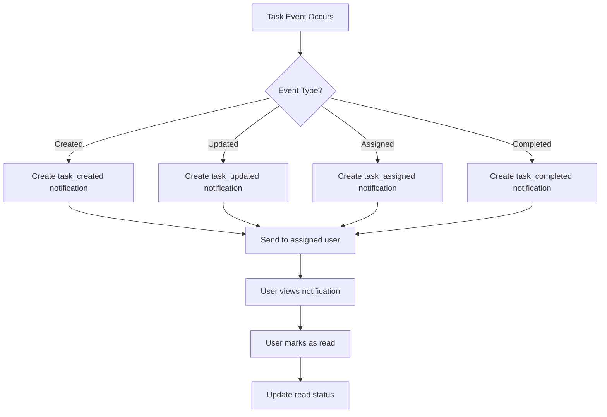

## Overview

The Notification System keeps users informed about task-related events such as task assignments, updates, and completions. Notifications are delivered per user and can be marked as read.

## Notification Data Structure

The notification system includes the following fields:

<ParamField path="id" type="integer">
  Unique notification identifier (auto-generated)
</ParamField>

<ParamField path="userId" type="integer" required>
  ID of the user who should receive this notification
</ParamField>

<ParamField path="userName" type="string">
  Username of the notification recipient
</ParamField>

<ParamField path="taskId" type="integer" required>
  ID of the task this notification is about
</ParamField>

<ParamField path="taskTitle" type="string">
  Title of the associated task
</ParamField>

<ParamField path="title" type="string" required>
  Notification title/subject
</ParamField>

<ParamField path="message" type="string" required>
  Detailed notification message
</ParamField>

<ParamField path="type" type="string" required>
  Notification type (e.g., "task_created", "task_updated", "task_assigned", "task_completed")
</ParamField>

<ParamField path="read" type="boolean" default="false">
  Whether the notification has been read
</ParamField>

<ParamField path="creationDate" type="DateTime">
  Timestamp when notification was created
</ParamField>

<ParamField path="modificationDate" type="DateTime">
  Timestamp when notification was last modified (e.g., marked as read)
</ParamField>

<ParamField path="active" type="boolean">
  Whether the notification is active
</ParamField>

## Notification Types

The system supports several notification types:

<Tabs>
  <Tab title="task_created">
    Sent when a new task is created that involves the user.
    
    **Icon**: 📋
    
    **Example**: "New task assigned: Migrate database schema"
  </Tab>
  
  <Tab title="task_updated">
    Sent when a task is modified (status change, priority change, etc.).
    
    **Icon**: ✏️
    
    **Example**: "Task updated: Priority changed from Medium to High"
  </Tab>
  
  <Tab title="task_assigned">
    Sent when a user is assigned to a task.
    
    **Icon**: 👤
    
    **Example**: "You have been assigned to: API Development"
  </Tab>
  
  <Tab title="task_completed">
    Sent when a task is marked as completed.
    
    **Icon**: ✅
    
    **Example**: "Task completed: Database migration finished"
  </Tab>
</Tabs>

## API Endpoints

### Get Notifications by User ID

Retrieves all notifications for a specific user.

```http
GET /api/notifications/user/{userId}
Authorization: Bearer {token}
```

<CodeGroup>
```javascript React Frontend
const loadNotifications = async () => {
  const response = await fetch(`/api/notifications/user/${user.id}`, {
    headers: {
      'Content-Type': 'application/json',
      'Authorization': `Bearer ${token}`
    }
  });
  
  const result = await response.json();
  if (result.success) {
    setNotifications(result.data || []);
  }
};
```

```json Response
{
  "success": true,
  "message": "Notifications retrieved successfully",
  "data": [
    {
      "id": 1,
      "userId": 2,
      "userName": "john_doe",
      "taskId": 5,
      "taskTitle": "Migrate database schema",
      "title": "Task Assigned",
      "message": "You have been assigned to task: Migrate database schema",
      "type": "task_assigned",
      "read": false,
      "creationDate": "2026-03-04T10:00:00",
      "modificationDate": null,
      "active": true
    },
    {
      "id": 2,
      "userId": 2,
      "userName": "john_doe",
      "taskId": 8,
      "taskTitle": "API Development",
      "title": "Task Updated",
      "message": "Priority changed from Medium to High on task: API Development",
      "type": "task_updated",
      "read": true,
      "creationDate": "2026-03-03T14:30:00",
      "modificationDate": "2026-03-04T09:15:00",
      "active": true
    }
  ]
}
```
</CodeGroup>

### Get Unread Notification Count

Retrieves the count of unread notifications for a user.

```http
GET /api/notifications/user/{userId}/unread-count
Authorization: Bearer {token}
```

<CodeGroup>
```javascript React Frontend
const loadUnreadCount = async () => {
  const response = await fetch(
    `/api/notifications/user/${user.id}/unread-count`,
    {
      headers: {
        'Authorization': `Bearer ${token}`
      }
    }
  );
  
  const result = await response.json();
  if (result.success) {
    setUnreadCount(result.data || 0);
  }
};
```

```json Response
{
  "success": true,
  "message": "Unread count retrieved successfully",
  "data": 5
}
```
</CodeGroup>

<Note>
This endpoint is useful for displaying badge counts in navigation bars or notification bells.
</Note>

### Create Notification

Creates a new notification for a user.

```http
POST /api/notifications
Authorization: Bearer {token}
Content-Type: application/json
```

<CodeGroup>
```javascript Backend Service Example
// This is typically called by the system, not directly by users
const createNotification = async (notificationData) => {
  const response = await fetch('/api/notifications', {
    method: 'POST',
    headers: {
      'Content-Type': 'application/json',
      'Authorization': `Bearer ${token}`
    },
    body: JSON.stringify({
      userId: 2,
      taskId: 5,
      title: 'Task Assigned',
      message: 'You have been assigned to task: Migrate database schema',
      type: 'task_assigned'
    })
  });
  
  return await response.json();
};
```

```json Request Body
{
  "userId": 2,
  "taskId": 5,
  "title": "Task Assigned",
  "message": "You have been assigned to task: Migrate database schema",
  "type": "task_assigned"
}
```

```json Response
{
  "success": true,
  "message": "Notification created successfully",
  "data": {
    "id": 15,
    "userId": 2,
    "taskId": 5,
    "title": "Task Assigned",
    "message": "You have been assigned to task: Migrate database schema",
    "type": "task_assigned",
    "read": false,
    "creationDate": "2026-03-04T10:30:00"
  }
}
```
</CodeGroup>

<Warning>
Notification creation is typically handled by the system automatically when task events occur. Manual creation should be used sparingly.
</Warning>

### Mark Single Notification as Read

Marks a specific notification as read.

```http
PUT /api/notifications/mark-read/{notificationId}
Authorization: Bearer {token}
```

<CodeGroup>
```javascript React Frontend
const markAsRead = async (notificationId) => {
  const response = await fetch(
    `/api/notifications/mark-read/${notificationId}`,
    {
      method: 'PUT',
      headers: {
        'Authorization': `Bearer ${token}`
      }
    }
  );
  
  const result = await response.json();
  if (result.success) {
    // Update local state
    setNotifications(prev => 
      prev.map(notification => 
        notification.id === notificationId 
          ? { ...notification, read: true }
          : notification
      )
    );
    setUnreadCount(prev => Math.max(0, prev - 1));
  }
};
```

```json Response
{
  "success": true,
  "message": "Notification marked as read successfully",
  "data": null
}
```
</CodeGroup>

### Mark All Notifications as Read

Marks all notifications for a user as read.

```http
PUT /api/notifications/mark-all-read/{userId}
Authorization: Bearer {token}
```

<CodeGroup>
```javascript React Frontend
const markAllAsRead = async () => {
  const response = await fetch(
    `/api/notifications/mark-all-read/${user.id}`,
    {
      method: 'PUT',
      headers: {
        'Authorization': `Bearer ${token}`
      }
    }
  );
  
  const result = await response.json();
  if (result.success) {
    // Update local state
    setNotifications(prev => 
      prev.map(notification => ({
        ...notification,
        read: true
      }))
    );
    setUnreadCount(0);
    showNotification('All notifications marked as read', 'success');
  }
};
```

```json Response
{
  "success": true,
  "message": "All notifications marked as read",
  "data": null
}
```
</CodeGroup>

## Frontend Implementation

The Notification Manager is implemented in `src/pages/NotificationManager.jsx`.

### Component Structure

```javascript
const NotificationManager = () => {
  const [notifications, setNotifications] = useState([]);
  const [loading, setLoading] = useState(true);
  const [unreadCount, setUnreadCount] = useState(0);
  
  const { token, user } = useAuth();
  
  useEffect(() => {
    loadNotifications();
    loadUnreadCount();
  }, [user]);
};
```

### Notification Display

```javascript
<div className="notifications-list">
  {notifications.map((notif) => (
    <div
      key={notif.id}
      className={`notification-card ${
        !notif.read ? 'unread' : 'read'
      }`}
    >
      <div className="notification-header">
        <span className="icon">
          {getNotificationIcon(notif.type)}
        </span>
        <h3>{notif.title}</h3>
        {!notif.read && (
          <span className="badge-new">New</span>
        )}
        <span className="timestamp">
          {formatDate(notif.creationDate)}
        </span>
      </div>
      
      <p className="notification-message">
        {notif.message}
      </p>
      
      {notif.taskTitle && (
        <div className="task-reference">
          <span>Task:</span> {notif.taskTitle}
        </div>
      )}
      
      {!notif.read && (
        <button onClick={() => markAsRead(notif.id)}>
          Mark Read
        </button>
      )}
    </div>
  ))}
</div>
```

### Unread Count Badge

```javascript
<div className="notification-bell">
  <svg><!-- bell icon --></svg>
  {unreadCount > 0 && (
    <span className="badge">{unreadCount}</span>
  )}
</div>
```

### Notification Icons

```javascript
const getNotificationIcon = (type) => {
  switch (type) {
    case 'task_created':
      return '📋';
    case 'task_updated':
      return '✏️';
    case 'task_assigned':
      return '👤';
    case 'task_completed':
      return '✅';
    default:
      return '📢';
  }
};
```

## Notification Workflow



## Real-time Updates

<Note>
The current implementation uses polling to check for new notifications. Future enhancements could include:
- WebSocket support for real-time push notifications
- Server-Sent Events (SSE) for live updates
- Push notifications for mobile devices
</Note>

### Polling Example

```javascript
useEffect(() => {
  // Poll for new notifications every 30 seconds
  const interval = setInterval(() => {
    loadUnreadCount();
  }, 30000);
  
  return () => clearInterval(interval);
}, [user]);
```

## Integration with Task Events

Notifications are automatically created when task events occur:

```javascript
// Example: When a task is assigned
const assignTask = async (taskId, userId) => {
  // Update task
  await updateTask({ id: taskId, asignedId: userId });
  
  // Create notification
  await createNotification({
    userId: userId,
    taskId: taskId,
    title: 'Task Assigned',
    message: `You have been assigned to task: ${taskTitle}`,
    type: 'task_assigned'
  });
};
```

## Best Practices

1. **Regular Cleanup**: Periodically check and mark old notifications as read
2. **Selective Notifications**: Only send notifications for meaningful events
3. **Clear Messages**: Write concise, actionable notification messages
4. **Batch Processing**: Consider marking multiple notifications as read at once
5. **User Preferences**: Future enhancement could include notification preferences

## Notification Management Tips

<Tabs>
  <Tab title="For Users">
    - Review notifications regularly to stay updated
    - Mark notifications as read to keep your list manageable
    - Use the "Mark All Read" feature to clear old notifications quickly
    - Pay attention to notification types to prioritize actions
  </Tab>
  
  <Tab title="For Administrators">
    - Monitor notification delivery to ensure system health
    - Consider implementing notification retention policies
    - Track notification read rates to measure engagement
    - Plan for notification archival strategy
  </Tab>
</Tabs>